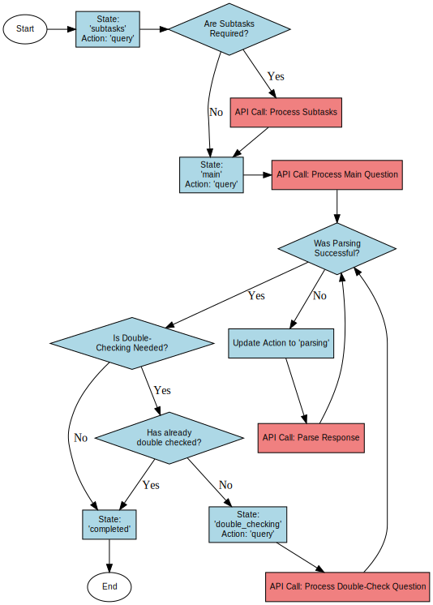

# `question_muni_pair.py` README

## Overview

The `question_muni_pair.py` module defines the `QuestionMuniPair` class, the core object of the project. This class pairs a specific zoning question with a municipality and manages the entire lifecycle of processing that question. It builds the necessary context, interacts with OpenAI’s API, parses responses, handles subtasks, calculates costs, and manages state transitions.

## Key Inputs and Outputs

### Inputs:

- **`question`** (`dict`): A dictionary containing details about the question. Key fields include:
  - **`'ID'`**: The unique identifier for the question.
  - **`'Question Detail'`**: The version of the question that gets embedded and used for generating context.
  - **`'Question Rephrase'`**: The actual phrasing of the question that the language model sees.
  - **`'Double Check Question'`**: A rephrased version of the question used when the answer needs to be double-checked.
  - **`'Question Type'`**: The type of question (e.g., `'Binary'`, `'Numerical'`, `'Lot Size'`).
  - **`'Prior'`**: The expected answer for the question (if any). If the model’s answer differs from this, the question enters a double-checking state.
  - Additional fields that are used in processing.

- **`muni`** (`dict`): A dictionary containing information about the municipality. Key fields include:
  - **`'Muni'`**: The name or identifier of the municipality.
  - **`'State'`**: The state in which the municipality is located.

- **`model`** (`str`): The name of the OpenAI model being used (e.g., `'gpt-3.5-turbo'`, `'gpt-4'`).

### Outputs:

The primary output is produced by the `get_final_response()` method, which returns a dictionary with the following key fields:

- **`Answer`**: The parsed answer to the question.
- **`Dont_Know`**: Boolean indicating whether the model was unable to provide an answer.
- **`All Answers`**: A list of all parsed answers (for ensemble methods or multiple responses).
- **`Explanation`**: The open-ended explanation provided by the model.
- **`Context`**: The context that the model used to derive its answer.
- **`Muni`**: The name or identifier of the municipality.
- **`Question`**: The question ID.
- **`Cost`**: The total cost of the OpenAI API calls used during processing.
- **`Subtasks`**: Any subtasks that were processed, including their answers and descriptions.
- **`Prompt`**: The prompt sent to OpenAI’s API.
- **`First_Attempt`** (optional): If double-checking was performed, this field contains the data from the first attempt at answering the question.

## State and Action Explanation

The `QuestionMuniPair` class uses a state machine to manage processing. There are two key variables that determine what happens next:

- **`state`**: Tracks where the object is in the logic tree.
  - **`'subtasks'`**: Processing subtasks.
  - **`'main'`**: Processing the main question.
  - **`'double_checking'`**: Reprocessing to verify the answer (if the answer differs from the prior).
  - **`'completed'`**: Final state after all processing is done.
  
- **`action`**: Specifies what type of task is being performed.
  - **`'query'`**: Indicates that a query is being sent to the OpenAI API.
  - **`'parsing'`**: Indicates that the system is parsing the response, and potentially requires additional API interactions if automatic parsing fails.

### Logic Tree of the State Machine

The following diagram shows the processing flow of the algorithm, highlighting when an API call is needed and the transitions between states.

- **Blue Nodes**: Represent the current state and action combination.
- **Red Nodes**: Indicate an API call is required at that point in the process.
- **Decision Nodes**: These diamond-shaped nodes represent conditional logic, such as whether subtasks are required, parsing success, and double-checking conditions.

### State Transitions:

1. **Initialization**: The object begins in the `'subtasks'` state, and `action` is set to `'query'`.

2. **Subtasks Processing**:
   - If the question requires subtasks (i.e., preliminary background research), the system makes an API call to process these subtasks.
   - After subtasks are processed, the state transitions to `'main'`.
   - If no subtasks are needed, the system skips to the `'main'` state immediately.
   
   **Example Subtask**:
   - **Question Detail**: "What is the minimum lot size in single-family districts?"
   - **Subtask Question**: "Find the name of each single-family residential district."
   - **Subtask Instructions**: "Please list the names of each single-family residential district. Only include districts that are primarily residential. Usually, this means districts that start with the letter R, like R1. If you are unsure whether a residential district permits single-family zoning, then assume that it does."
   - This helps gather specific information that will be incorporated into the final answer.

3. **Main Processing**:
   - In the `'main'` state, the system builds the context for the question and makes an API call to OpenAI.
   - Once the response is received, the system parses the response. If parsing is successful, it checks if the answer differs from the prior.
     - **Double-Checking**: If the answer differs from the prior (and a prior is available), the state transitions to `'double_checking'`.
     - If the answer matches the prior or no prior is available, the state transitions to `'completed'`.

4. **Double-Checking**:
   - In the `'double_checking'` state, the context is rebuilt, and the question is rephrased using the `'Double Check Question'` field.
   - The question is processed again via an API call, and the response is parsed.
   - Double-checking happens only once, and the double-checked answer is always used, regardless of whether it matches the prior.
   - Once double-checking is complete, the state transitions to `'completed'`.

5. **Completion**:
   - In the `'completed'` state, processing is finished, and the `get_final_response()` method can be called to retrieve the final output.

### API Call Points:

- **Subtask Processing**: When subtasks are required, an API call is made to gather the necessary information.
- **Main Question Processing**: An API call is made to process the main question using the context built from the municipality’s data.
- **Parsing Failures**: If the automatic parsing fails (i.e., the response does not follow the expected format), an API call is made to ask the model to reformat its answer.
- **Double-Checking**: If the answer requires verification, an API call is made to process the question again with updated context or a rephrased question.

## Cost Calculation

For each API call, the cost is calculated based on the number of tokens used. The cost information is sourced from `cg.cost_dict` in the `gpt_functions.py` file.

- **Input tokens**: Tokens sent to the model (prompt, context, instructions).
- **Output tokens**: Tokens received from the model (the response).
- Costs per million tokens are defined in the `cost_dict` from the `gpt_functions` module.
- The process takes advantage of asynchronous batching, which provides a 50% cost reduction.
- Costs are accumulated throughout the processing and reported in the final response.

## Response Handling and Parsing

### Open-Ended Responses:

The language model is instructed to format its answers using the format `'ANSWER: <answer>'`. The system attempts to split the response on `'ANSWER:'` and extract the answer.

- **Binary Questions**: Expected answers are `'Yes'`, `'No'`, or `'I DON'T KNOW'`.
- **Numerical Questions**: The system expects a number in response.

### Function Calls for Parsing:

If the system is unable to parse the response correctly, it makes another API call to reformat the answer into the expected structure. For example, a function call might extract a numeric value from a more verbose answer.

## Context Building and `format_prompt()`

The `context_builder()` function generates the relevant context from the municipality's data. This context is passed to the model to help it provide a more accurate answer. More details about context building are available in the `context_building.py` README.

### Prompt Formatting:

The `format_prompt()` method structures the prompt using markdown-like

 syntax with triple hashtags (`###`). This format clearly separates the components of the prompt, including the question, background information, and context.

